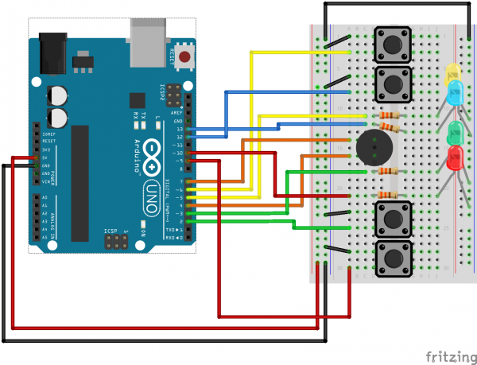

## Simon

This is a project we found at Sparkfun. See [Experiment 16: Simon Says](https://learn.sparkfun.com/tutorials/sik-experiment-guide-for-arduino---v32/experiment-16-simon-says) for more details.

You can use this diagram to wire up your Arduino

Then open [Simon.ino](Simon.ino) in the Arduino IDE, and play!
